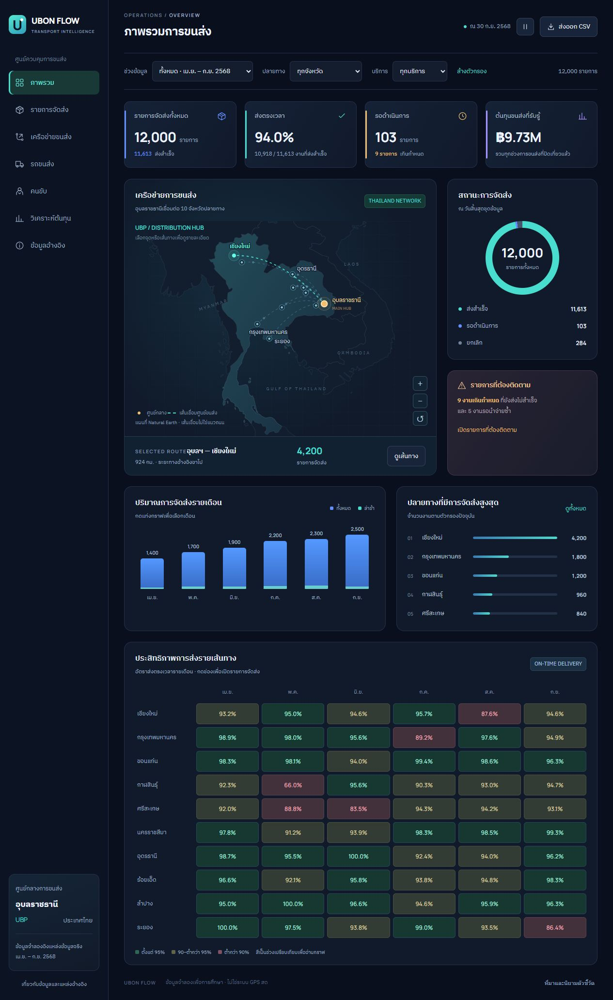

# UBON FLOW — Logistics DSS Dashboard

Dashboard ภาษาไทยสำหรับติดตามการจัดส่งจากอุบลราชธานี พร้อมแผนที่ประเทศไทย เส้นปะเคลื่อนไหว รายละเอียดงานส่ง เที่ยวรถ รถและคนขับ วิเคราะห์ต้นทุน และเปรียบเทียบเส้นทาง

## เปิด Dashboard

จากราก repository รัน `python -m http.server 4173 --bind 127.0.0.1 --directory dashboard` แล้วเปิด http://127.0.0.1:4173/

สำหรับ Vercel ตั้ง **Root Directory เป็น `dashboard`**, Framework Preset เป็น **Other**, ไม่ต้องมี Build Command และใช้รากโฟลเดอร์ Dashboard เป็น Output Directory

ดู [คู่มือ Dashboard](dashboard/README.md), [พจนานุกรมข้อมูล](DATA_DICTIONARY.md) และ [ผลตรวจคุณภาพข้อมูล](DATA_QUALITY.md)

## ชุดข้อมูลโลจิสติกส์จำลอง: ศูนย์อุบลราชธานี

ข้อมูลนี้จำลองบริษัทขนส่งสินค้าในช่วง 1 เมษายน - 30 กันยายน 2568 (2025) โดยใช้อุบลราชธานีเป็นศูนย์กลาง และให้เชียงใหม่มีจำนวนรายการส่งมากที่สุดตามที่ผู้ใช้กำหนด ข้อมูลบุคคล การส่งสินค้า และค่าใช้จ่ายรายเที่ยวเป็นข้อมูลสมมติทั้งหมด

## ข้อมูลจริงที่ใช้เป็นฐาน

1. **ระยะทางถนน:** ขอเส้นทางจาก OSRM บนโครงข่าย OpenStreetMap ระหว่างจุดประมาณศูนย์เมือง เก็บ response ของขาไปและกลับไว้ใน `data/reference/osrm/` และ URL ของแต่ละคำขอไว้ใน `routes.csv` ค่านี้เป็นระยะทางคำนวณด้วย profile รถยนต์ ไม่ใช่ GPS รถบรรทุก และไม่ใช่โครงข่ายถนนย้อนหลังปี 2568 มี attribution [OpenStreetMap contributors](https://www.openstreetmap.org/copyright) และ [OSRM API](https://project-osrm.org/docs/v5.24.0/api/)
2. **น้ำมัน:** รายงานเปรียบเทียบราคาขายปลีกของสำนักงานนโยบายและแผนพลังงาน (EPPO) เดือนเมษายน - กันยายน 2568 ให้ค่าดีเซลประเทศไทย 31.94 บาท/ลิตรในรายงานที่ใช้อ้างอิง ใช้เป็น benchmark ประจำเดือน ไม่อ้างว่าเป็นราคาเฉลี่ยรายเดือนหรือราคาจริงทุกวัน ดู URL แยกรายเดือนใน `fuel_price_reference.csv` และ `sources.csv`
3. **รถ:** [ISUZU TRUCKS Thailand](https://truck.isuzu-tis.com/product) ระบุ GVW ของ NLR 4.4 ตัน, NPR 8.5 ตัน และ FTR 15 ตัน ซึ่งเป็นน้ำหนักรถรวมสินค้า ไม่ใช่น้ำหนักสินค้าอย่างเดียว น้ำหนักรถรวมตัวถัง ความจุใช้งาน ปริมาตรตัวถัง และอัตราประหยัดน้ำมันเป็นสมมติฐานแยกไว้ใน `vehicle_models.csv`
4. **ตรวจเทียบเส้นทางหลัก:** [นครชัยแอร์ อุบล - เชียงใหม่](https://www.nakhonchaiair.com/ncaweb/th/route/25) เผยแพร่ระยะทางเส้นทางรถโดยสาร 1,043 กม. ต่างจาก OSRM เพราะเลือกทางและจุดปลายต่างกัน ใช้ตรวจบริบทเท่านั้น ไม่ใช้แทนระยะทางถนนที่ดึงมาสำหรับข้อมูลชุดนี้ และไม่ใช้เวลาเดินรถโดยสารเป็นเวลารับประกันของรถบรรทุก
5. **บริบทการส่ง:** [ไปรษณีย์ไทย EMS](https://www.thailandpost.co.th/un/article_detail/faq/94/735) มีมาตรฐานประมาณ 1-2 วันทำการและมีเงื่อนไข cutoff/พื้นที่ บริษัทจำลองของเราใช้นโยบาย 1/2/3 **วันปฏิทิน** ที่ระบุเอง ไม่ใช่การจำลอง SLA หรือราคาของไปรษณีย์ไทย
6. **บริบทฤดูกาล:** [กรมอุตุนิยมวิทยา](https://tmd.go.th/climate/generalizedmonsoonindex) อธิบายมรสุมช่วงประมาณกลางพฤษภาคม - กลางตุลาคม ใช้ตั้งบริบทฤดูกาลเท่านั้น ฝนรายวัน การจราจร พยากรณ์และผลกระทบล่าช้าเป็นข้อมูลสุ่ม ไม่มีข้อมูลสังเกตอากาศจริงปี 2568

การตรวจข้อมูลทำวันที่ 2 ตุลาคม 2569 (2026-10-02) แยกจากช่วงจำลองปี 2568 ชุดข้อมูลมีฐานอ้างอิงจริง แต่ไม่ใช่ข้อมูลดำเนินงานจริงหรือข้อมูลที่ปรับเทียบกับสถิติของบริษัทใด หากต้องการอ้างประสิทธิภาพการขนส่งจริง จำเป็นต้องมีบันทึกจากผู้ประกอบการเพิ่มเติม

## ขนาดและความสัมพันธ์

- 12,000 รายการส่งสินค้า (shipment) จาก 600 ชุดจอง ชุดละ 20 รายการ
- เชียงใหม่ 35%, กรุงเทพฯ 15%, ขอนแก่น 10%, กาฬสินธุ์ 8%, ศรีสะเกษ 7%, นครราชสีมา 6%, อุดรธานี 6%, ร้อยเอ็ด 5%, ลำปาง 4%, ระยอง 4% เป็นสัดส่วนสถานการณ์สมมติ โดยเชียงใหม่มากที่สุดทั้งจำนวนที่จองและส่งสำเร็จ
- รถ 46 คัน: NPR 12 คัน และ FTR 12 คันอยู่ที่อุบลสำหรับ linehaul; NLR 22 คันอยู่ที่ปลายทาง เชียงใหม่ 4 คันและอีก 9 จังหวัดแห่งละ 2 คันสำหรับ last mile การจัดรถนี้เป็นสมมติฐานให้สอดคล้องกับเชียงใหม่ที่มีงานมากที่สุด
- คนขับสมมติ 70 คน: linehaul 2 คนต่อรถ และ last mile 1 คนต่อรถ ใช้รหัส/ชื่อจำลอง ไม่มีข้อมูลส่วนบุคคลจริง
- ลูกค้าจำลอง 300 ราย ศูนย์จำลอง 11 แห่ง เส้นทาง 20 รูปแบบ (linehaul 10 และ local loop 10)
- จำนวนเที่ยวและจำนวน events สร้างตามภาระงาน รวมการลองส่งใหม่เมื่อผู้รับไม่อยู่ ดูจำนวนจริงใน `data/summary.json`

หนึ่ง shipment คือหนึ่งรายการส่งสินค้า อาจมีหลายกล่อง มีน้ำหนักสมมติ 5-180 กก. ไม่จำกัดว่าเป็นพัสดุ EMS ส่วนหนึ่ง trip คือหนึ่งรอบการใช้รถ **รวมกลับศูนย์ประจำ**

เที่ยวขนส่งระหว่างจังหวัดออกจากอุบล ไปศูนย์ปลายทาง แล้วกลับอุบลโดยสมมติขากลับไม่มีสินค้า รถประจำปลายทางส่งต่อถึงลูกค้าและกลับศูนย์ปลายทาง แต่ละ shipment จึงเชื่อมกับอย่างน้อยสองเที่ยวผ่าน `shipment_legs.csv` หากลองส่งใหม่จะมี last-mile leg เพิ่มอีกหนึ่งเที่ยว

## ไฟล์ที่ใช้ทำขั้นถัดไป

| ไฟล์ CSV ใน data/ | สิ่งที่เก็บ |
|---|---|
| shipments | รายการส่ง น้ำหนัก จำนวนกล่อง ลูกค้า เวลาจอง SLA สถานะและผลส่ง |
| trips | เที่ยวรถ เวลาแผน/ผลจริง สินค้าที่บรรทุก ระยะทาง น้ำมันและต้นทุน |
| shipment_legs | เชื่อม shipment กับเที่ยวแต่ละช่วงและต้นทุนที่จัดสรร |
| shipment_events | ประวัติ BOOKED, ACCEPTED, LOADED_LINEHAUL, DEPARTED_ORIGIN, ARRIVED_DESTINATION_HUB, OUT_FOR_DELIVERY, DELIVERY_ATTEMPT_FAILED, DELIVERED, CANCELLED |
| trip_driver_assignments | คนขับที่ได้รับมอบหมายในแต่ละเที่ยว |
| trip_costs | ต้นทุน 6 หมวดของเที่ยวที่ปิดแล้ว |
| vehicle_models, vehicles, drivers | รุ่นรถ สเปก/สมมติฐาน รถและคนขับจำลอง |
| customers, hubs, routes | ลูกค้า ศูนย์และเส้นทาง |
| calendar, route_conditions | วัน ปัจจัยฤดูกาล และสภาพเส้นทางจำลอง |
| vehicle_maintenance, vehicle_daily | ช่วงรถไม่พร้อมใช้งาน และตัวหารการใช้รถรายวัน |
| fuel_price_reference, sources | ค่าราคาฐานและแหล่งอ้างอิง |
| data_dictionary | ชนิดข้อมูล หน่วย ค่าว่าง ความสัมพันธ์และ provenance ทุกคอลัมน์ |

`data/logistics_data.json` รวมทุกตารางพร้อม metadata และ `data/assumptions.json` แสดงสูตร/ช่วงค่า/ความน่าจะเป็นที่สมมติไว้ เปลี่ยนค่าพารามิเตอร์ได้จาก generator เพื่อสร้างสถานการณ์ใหม่โดยไม่อ้างว่าเป็นข้อมูลจริง

CSV เป็น UTF-8 BOM เพื่อให้อ่านภาษาไทยใน Excel ได้ง่าย ตัวเลขไม่มีสัญลักษณ์สกุลเงิน เวลาเป็น ISO 8601 มี `+07:00` ช่องว่างหมายถึง null ไม่ใช่ศูนย์ JSON ใช้ null และ boolean จริง

## กติกาเวลา สถานะ และต้นทุน

Snapshot คงที่ที่ 30 กันยายน 2568 เวลา 23:59:59 ประเทศไทย ข้อมูล actual และ events หลังเวลานี้จะไม่แสดง กำหนดส่งที่ยังอยู่ในอนาคตแสดงได้ เพราะเป็นข้อมูลแผน ไม่กรอก actual_delivery ให้รายการค้างเป็นศูนย์

สถานะ DELIVERED แยกการตรงเวลาผ่าน `is_ontime` รายการค้างมี `is_overdue_open` ส่วน CANCELLED ถูกยกเลิกก่อนบรรทุก จึงไม่มี legs และไม่มีต้นทุนขนส่ง การไม่พบเวลาส่งไม่ได้แปลว่ายกเลิกโดยอัตโนมัติ

โมเดลมีลูกค้าไม่อยู่ประมาณ 6% ของการลองส่งครั้งแรก มีการลองส่งใหม่จริงเป็นอีก trip และอีก leg คนขับและรถไม่มีเที่ยวซ้อน เวลาใช้รถรวมการกลับ ไม่ย้ายรถกลับอุบลทันทีเมื่อส่งถึงปลายทาง ช่วง maintenance ถูกกันออกจากแผน รถ linehaul เว้นอย่างน้อย 12 ชั่วโมงก่อนใช้รอบถัดไป รถ local เว้น 10 ชั่วโมง ตัวเลขนี้เป็นกติกาแบบจำลอง ไม่ใช่การยืนยันว่าตารางทำงานผ่านข้อกฎหมายทุกข้อ

ต้นทุนประกอบด้วยน้ำมัน คนขับ/เบี้ยเลี้ยง งบค่าผ่านทาง ค่าซ่อมบำรุงเฉลี่ย ค่าเสื่อม และการจัดการสินค้า ทั้งหมดเป็นผลจากแบบจำลอง โดยค่าหน่วยน้ำมันมีฐาน EPPO ส่วนที่เหลือเป็นสมมติฐาน **ไม่ใช่ใบเสร็จหรืออัตราค่าจ้างจริง** ยอดต้นทุนรวมมีน้ำมันอยู่แล้ว ไม่บวกค่าน้ำมันซ้ำ

รับรู้ต้นทุนทั้งเที่ยวเมื่อรถจบรอบกลับศูนย์ จัดสรรต้นทุนตามน้ำหนักด้วยการปัดเศษที่รักษายอดรวมถึงสตางค์ รายการที่ส่งถึงแล้วอาจยังไม่รับรู้ต้นทุน linehaul ครบเพราะรถกำลังกลับ ให้ตรวจ `all_transport_costs_settled` ก่อนวิเคราะห์ต้นทุนต่อ shipment กำหนด `customer_charge_thb` เป็นราคาสมมติที่แจ้งเมื่อรับงาน ไม่ใช่ต้นทุน และไม่ถือว่าเป็นรายได้ที่รับรู้แล้วโดยอัตโนมัติ

ห้ามนำ trips ไป join กับ shipments แล้วรวมต้นทุนเต็มเที่ยวซ้ำทุก shipment ให้รวมจาก `trips` โดยตรง หรือใช้ต้นทุนที่แบ่งไว้ใน `shipment_legs`

## KPI ที่ข้อมูลรองรับ

1. OTD = จำนวน DELIVERED ที่ is_ontime เป็น True / จำนวน DELIVERED x 100 รายการค้างไม่อยู่ในตัวหาร แสดงจำนวนค้างเกินกำหนดควบคู่ด้วย ตัวกรองเวลาให้ระบุว่าเป็นเดือนรับงานหรือเดือนส่งถึง และรวมอัตราจากตัวเศษ/ตัวหาร ไม่เฉลี่ยเปอร์เซ็นต์เดือน
2. ระยะเวลาส่ง = actual_delivery_at - created_at เฉพาะส่งสำเร็จ แยกจากเวลาขับรถและเวลาครอบครองรถ
3. Cost/km = SUM(actual_freight_cost_thb) / SUM(actual_round_trip_km) เฉพาะ cost_is_settled=True รวมขากลับในทั้งต้นทุนและระยะทาง ห้ามรวมทั้ง trips และ shipment_legs ซ้ำกัน
4. อัตราครอบครองรถ = SUM(occupied_hours) / SUM(available_hours) x 100 รวมพักปลายทาง เป็นการใช้ทรัพยากร ไม่ใช่เวลาวิ่งเครื่องยนต์ หากต้องการอัตรารถที่วิ่งงาน ใช้จำนวน vehicle-days ที่ departure_count>0 / vehicle-days ที่ available_hours>0 และตั้งชื่อให้ชัด
5. ประหยัดน้ำมัน = SUM(actual_round_trip_km) / SUM(actual_fuel_litres) ของเที่ยวที่ปิดแล้ว หน่วย กม./ลิตร ไม่เฉลี่ยค่ารายเที่ยวแบบไม่ถ่วงน้ำหนัก

## การใช้กับ Data Mining

ใช้ features ที่มีอยู่ก่อนทำนาย เช่น ระยะทางแผน ประเภทรถ น้ำหนัก ประเภทบริการ เวลานัด คะแนนคนขับก่อนช่วงข้อมูล และ rain_forecast_flag/traffic_forecast_level ไม่ใช้ actual_delivery, delay, customer_rating, observed_rain, ค่าใช้จ่ายจริง หรือ outcome ของการส่งใหม่เป็นตัวทำนายก่อนออกเดินทาง

Label การส่งล่าช้ามีเฉพาะรายการ DELIVERED รายการค้างเป็น censored ไม่ใช่ On-time และควรแบ่ง train/test ตามเวลา ผลประเมินบนข้อมูลจำลองเป็นการสาธิตวิธี ไม่ใช่ความแม่นยำของระบบเมื่อใช้กับข้อมูลจริง การจัดกลุ่มคนขับควรแยกประเภทรถ/งาน/เส้นทางเพื่อไม่ให้คะแนนจากภาระงานต่างกันถูกตีความเป็นทักษะเพียงอย่างเดียว

## ตรวจสอบและสร้างซ้ำ

ใช้ `scripts/generate_data.py` ด้วย Python 3 โดยใช้ Python standard library และ seed 20251002 การสร้างซ้ำใช้ route responses ที่เก็บไว้ จึงไม่ต้องเรียก API อีก หากเรียก `fetch_routes.ps1` ใหม่ผลถนนอาจเปลี่ยนและต้องเก็บเวอร์ชันใหม่

ผลการตรวจรหัส ความสัมพันธ์ ความจุรถ เวลาส่ง ลำดับสถานะ การจองรถซ้อน maintenance และการกระทบยอดต้นทุนอยู่ใน `data/summary.json` ไฟล์ `outputs/ubon-2026-10-02/Logistics-Data-Overview.xlsx` เป็นภาพรวมข้อมูล ไม่แทนชุด CSV/JSON ฉบับเต็ม

ไฟล์อ้างอิงกรมทางหลวงที่พบจาก MOT Data Catalog ไม่สามารถดาวน์โหลดจาก URL ที่เชื่อมไว้ได้ จึงไม่ได้ใช้ค่าจากไฟล์ดังกล่าวคำนวณเส้นทางของชุดนี้
